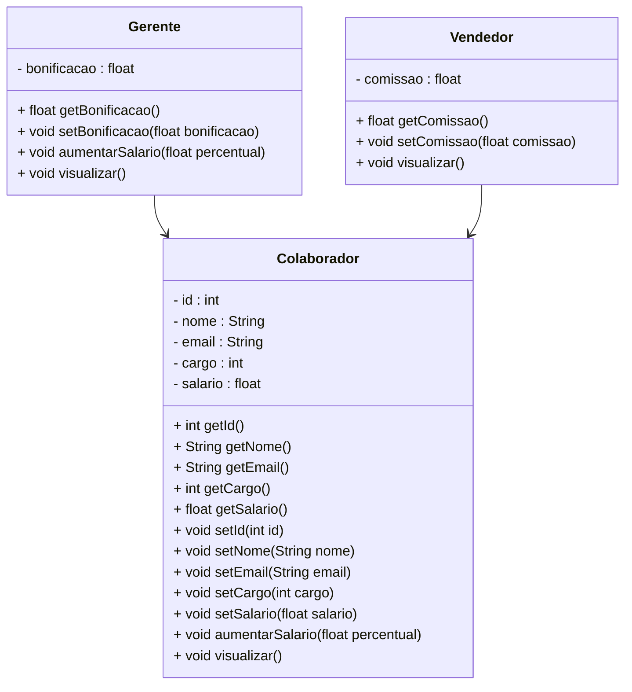

# Projeto RH - POO (Em desenvolvimento)

 

   

  

## Diagrama de Classes

```mermaid
classDiagram
class Colaborador {
  - id : int
  - nome : String
  - email : String
  - cargo : int
  - salario : float
  + int getId()
  + String getNome()
  + String getEmail()
  + int getCargo()
  + float getSalario()
  + void setId(int id)
  + void setNome(String nome)
  + void setEmail(String email)
  + void setCargo(int cargo)
  + void setSalario(float salario)
  + void aumentarSalario(float percentual)
  + void visualizar()
}
class Gerente {
  - bonificacao : float
  + float getBonificacao()
  + void setBonificacao(float bonificacao)
  + void aumentarSalario(float percentual)
  + void visualizar()
}
class Vendedor {
  - comissao : float
  + float getComissao()
  + void setComissao(float comissao)
  + void visualizar()
}
Gerente --> Colaborador
Vendedor --> Colaborador
```

  

## Print da Tela

   

